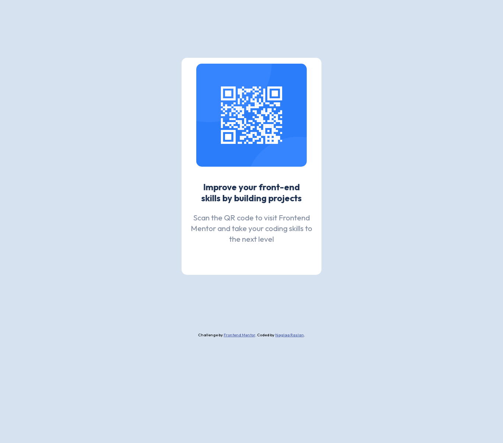

# Frontend Mentor - QR code component solution

This is a solution to the [QR code component challenge on Frontend Mentor](https://www.frontendmentor.io/challenges/qr-code-component-iux_sIO_H). Frontend Mentor challenges help you improve your coding skills by building realistic projects. 

## Table of contents

- [Overview](#overview)
  - [Screenshot](#screenshot)
  - [Links](#links)
- [My process](#my-process)
  - [Built with](#built-with)
- [Author](#author)

**Note: Delete this note and update the table of contents based on what sections you keep.**

## Overview

### Screenshot

- Desktop version:  
- mobile version: 

### Links

- Solution URL: [Github repo](https://github.com/naglorias/Qr-code.git)
- Live Site URL: [Live url](https://naglorias.github.io/Qr-code/)

## My process

### Built with

- Semantic HTML5 markup
- CSS custom properties
- Flexbox
- Desktop-first workflow

**Note: These are just examples. Delete this note and replace the list above with your own choices**

## Author

- Website - [My Github](https://github.com/naglorias)
- Frontend Mentor - [@naglorias](https://www.frontendmentor.io/profile/naglorias)

**Note: Delete this note and add/remove/edit lines above based on what links you'd like to share.**

